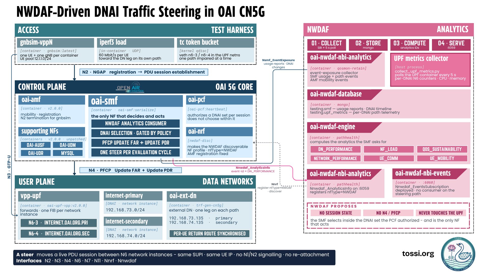

# NWDAF-Driven Traffic Steering on OAI 5G SA

*The NWDAF measures each data-network path, and the SMF acts on it — moving a live PDU
session between two N6 paths without interrupting the subscriber.*

This repository extends the [OpenAirInterface 5G Core](https://gitlab.eurecom.fr/oai/cn5g)
so that the network can change the exit path of a running data session. The session
stays up and keeps its IP address; only the path its traffic takes changes.

* * *

## Contents

| Section | |
|---|---|
| [Overview](#overview) |   |
| [Architecture](#architecture) | Components and data flow |
| [Steering Modes](#steering-modes) | RATE and HEALTH |
| [Repository Layout](#repository-layout) | |
| [Prerequisites](#prerequisites) | |
| [Install and Verify](#install-and-verify) | |
| [Build](#build) | |
| [Deploy](#deploy) | |
| [UEs and Test Traffic](#ues-and-test-traffic) | |
| [HEALTH Steering Test](#health-steering-test) | |
| [RATE Steering Test](#rate-steering-test) | |
| [Checking the Result](#checking-the-result) | |
| [Troubleshooting](#troubleshooting) | |
| [Clean Up](#clean-up) | |
| [Known Limitations](#known-limitations) | |
| [Development](#development) | |
| [Quick Start](#quick-start) | |
| [Upstream and License](#upstream-and-license) | |

* * *

## Overview

A 5G core normally picks a data-network exit point when a session is created and then
leaves it alone. If that path later degrades, nothing reacts — moving the session
means tearing it down and building a new one, which the subscriber notices.

This project closes that loop. The network measures both paths continuously and moves
sessions between them while they are running.

A subscriber's traffic leaves the core through the UPF on the **N6** interface. This
lab gives the UPF two N6 paths:

| Path | DNAI | UPF network instance | Interface | Subnet |
|---|---|---|---|---|
| Primary | `internet-primary` | `internet.oai.org.pri` | `n6-3` | `192.168.73.0/24` |
| Secondary | `internet-secondary` | `internet.oai.org.sec` | `n6-4` | `192.168.74.0/24` |

A **DNAI** (Data Network Access Identifier) is 3GPP's name for "which exit point the
traffic should use". **Traffic steering** here means changing which DNAI a live
session uses, without interrupting it.

The design follows one rule:

> **The NWDAF proposes. The PCF authorizes. The SMF decides. The UPF enforces.**

The NWDAF only publishes measurements and holds no session state. The PCF publishes
the set of DNAIs each subscriber may use. The SMF chooses only within that set. This
is why the PCF is a required component, not an optional one.

* * *

## Architecture



*Figure A — `MOD` marks an upstream OAI component modified here, `NEW` a component
written for this project, `LAB` test scaffolding.*

### Modified 5G network functions

Three OAI network functions were modified. The changes are kept as patches against
pinned upstream commits in [`patches/`](patches/) rather than vendored source.

| NF | Change, at a high level |
|---|---|
| **SMF** | Consumes NWDAF analytics, selects a DNAI from the PCF-authorized set, and reprograms the UPF. It is the only NF that decides and acts. |
| **PCF** | Authorizes a set of DNAIs per subscriber. It does not choose between them. |
| **NRF** | Makes the NWDAF discoverable, plus a registration fix. |

AMF, UPF-VPP, AUSF, UDM and UDR are used **unmodified**.

### NWDAF services

Four Go services under [`nwdaf/`](nwdaf/), modified from `oai-cn5g-nwdaf`:

| Service | Role |
|---|---|
| `oai-nwdaf-sbi` | Collects SMF and AMF event exposure |
| `oai-nwdaf-engine` | Computes the analytics, including `DN_PERFORMANCE` |
| `oai-nwdaf-nbi-analytics` | Serves `Nnwdaf_AnalyticsInfo` on port 6059 — what the SMF polls |
| `oai-nwdaf-nbi-events` | Serves `Nnwdaf_EventsSubscription` on port 6060 |

Data is stored in MongoDB (`oai-nwdaf-database`).

### Host processes

Two processes run **outside** any container, and both are required. `make nwdaf`
starts them and checks that they came up.

| Process | Why it is required |
|---|---|
| `scripts/telemetry/collect_upf_metrics.py` | Polls per-DNAI UPF counters every 5 s. Without it there is no path health and HEALTH steering can never fire. |
| `scripts/lab/nwdaf_dn_route_sync.py` | Keeps the data network's per-UE return routes in step with the current path. Without it a steer breaks connectivity. |

### How information moves

```
1. Traffic         gnbsim -> N3/GTP-U -> vpp-upf -> N6 -> oai-ext-dn

2. Measurement     UPF usage reports  --> oai-nwdaf-sbi
                   UPF N6 counters    --> host collector --> MongoDB

3. Analytics       oai-nwdaf-engine computes DN_PERFORMANCE per DNAI

4. Consumption     oai-smf polls oai-nwdaf-nbi-analytics:6059   (every 10 s)

5. Authorization   oai-smf --N7--> oai-pcf returns the authorized DNAI set

6. Decision        oai-smf ranks the authorized DNAIs (RATE or HEALTH)

7. Actuation       oai-smf --N4/PFCP--> vpp-upf

8. Result          traffic leaves on the other N6 path, same session, same UE IP
```

* * *

## Steering Modes

The SMF supports two ranking rules. You pick one when you start the core, with
`make core RULE=RATE` or `make core RULE=HEALTH`. They are **mutually exclusive** —
the rule is fixed for the life of the SMF container, so each mode needs its own
`make core`.

| | RATE | HEALTH |
|---|---|---|
| Ranks on | Offered load (`avgTrafficRate`) | Observed path state |
| Moves sessions | Toward the busier path | Away from a degraded path |
| Reversible | No — one-way | Yes |
| Detection window | 300 s average | 5 s |
| Needs impairment to demonstrate | No | Yes |
| Extra gate | Confidence floor, unless `SMF_NWDAF_PREDICT_SEC=0` | None |
| Default | Yes | No |

**RATE** steers toward whichever authorized path carries the most traffic. It is the
original upstream-style behaviour. Because it always moves toward the busier path, it
cannot move a session back — once sessions converge on one path, that run is over.

**HEALTH** is the more useful mode. The host collector classifies each path every 5
seconds as healthy, degraded, or unknown. If the path a session is on is observed
degraded, the SMF moves it to the best authorized alternative; if the path is healthy
or unknown, it holds. Unknown is deliberately **not** treated as bad. The SMF also
remembers recently degraded paths for a short period so sessions do not immediately
steer back, and moves at most one session per cycle so a path drains gradually.

Use **HEALTH** unless you are specifically demonstrating RATE.

Both rules are project-specific. TS 23.288 defines the `DN_PERFORMANCE` analytic; it
does not define how a consumer ranks DNAIs. Every threshold and timer mentioned here
is tunable — see [`.env.example`](.env.example).

* * *

## Repository Layout

```text
.
├── Makefile                 Wrapper over scripts/. Nothing works only via make.
├── .env.example             Every tunable, with its default.
│
├── nwdaf/                   NWDAF services (Go)
├── patches/                 Changes to upstream OAI SMF, PCF and NRF
├── compose/                 Deployment topology
├── configs/
│   ├── nf/ulcl_config.yaml       shared NF configuration
│   └── pcf-policies/             the PCF's authorization data
│
└── scripts/
    ├── build.sh                  builds every image this deployment needs
    ├── verify_release.sh         offline check of the checkout
    ├── test-health.sh            automated HEALTH test, PASS/FAIL
    ├── test-rate.sh              automated RATE test, PASS/FAIL
    ├── deploy/                   core, NWDAF and container startup
    ├── lab/                      UE setup, traffic generation, route sync
    ├── telemetry/                per-DNAI UPF telemetry collector
    └── lib/                      shared shell helpers
```

### PCF policies

`configs/pcf-policies/` is the PCF's authorization data, in three parts — named PCC
rules, the DNAI sets they reference, and a mapping from each subscriber (SUPI) to a
rule. `make ues` regenerates the subscriber mapping for however many UEs you ask for.

> The PCF loads **every** file in `policy_decisions/`. Never leave a backup copy
> there — a stale file silently overrides the live one.

* * *

## Prerequisites

| Requirement | Detail |
|---|---|
| OS | Linux. Validated on Ubuntu 22.04 LTS. |
| Docker Engine | Version 24 or newer. |
| Docker Compose | **A separate package from Docker.** The v2 plugin is recommended. |
| `sudo` rights | Every script calls `sudo docker`. |
| Passwordless `sudo` | The host pollers start with `sudo -n` and fail rather than prompt. Without it, nothing ever steers. |
| Host packages | `iproute2`, `python3`, `python3-venv`, `curl`, `bc`, `git` |
| Network access | To clone from GitHub and GitLab, and pull unmodified OAI images. |

```bash
sudo apt update
sudo apt install -y iproute2 python3 python3-venv curl bc git \
                    docker.io docker-compose-plugin
```

Notes:

* **Compose is not included in `docker.io`.** Without it, `make core` stops immediately.
* **No Go or C++ toolchain is needed on the host** — every compiler runs in a container.
* **Python packages** are handled for you; `make nwdaf` creates a `.venv/` on first run.
* Allow roughly **8 GB RAM and 40 GB free disk**. The OAI C++ build images are large.

### External dependency

[`oai-cn5g-fed`](https://gitlab.eurecom.fr/oai/cn5g/oai-cn5g-fed) is required and is
deliberately not vendored here. It supplies the subscriber database — without it no UE
can authenticate — and the MySQL health check.

`make build-fed` clones it at a pinned commit and installs this repository's compose
file, NF configuration and PCF policies into it. Default location `$HOME/oai-cn5g-fed`;
override with `FED_DIR` at build time or `FED` at deploy time.

### Host ports

These must be free: **27017** (MongoDB), **6059** (analytics NBI), **6060** (events
NBI), **6062** (NWDAF SBI), **6063** (engine).

```bash
ss -lntp | grep -E ':(27017|6059|6060|6062|6063)\b' || echo "all free"
```

* * *

## Install and Verify

```bash
git clone https://github.com/Mragankk/oai-nwdaf-traffic-steering.git
cd oai-nwdaf-traffic-steering
```

Every command in this guide runs from the repository root. Run `make` with no
arguments at any time to list the available targets.

Before building, check that the checkout is complete and consistent:

```bash
make verify
```

This compiles the services, checks that the patches still apply, and parses every
script and config file. It works in temporary directories and throwaway containers:
no network function is restarted and no database is written, so it is safe to run even
while a deployment is live.

Results are reported as PASS, FAIL, SKIP or INFO. **`0 failed` is the only number that
must be zero.** SKIPs are expected on a fresh clone, because they check things that do
not exist until you have built — the count of passing checks rises as you build more.

`make verify` proves the repository **builds**. It cannot prove that steering
**works** — that needs a live deployment and the two runtime tests below.

* * *

## Build

Nothing is published to a registry, so you must build the images yourself.

The four NWDAF Go services and gnbsim build in about two minutes in total. **The three
OAI C++ network functions are the slow part** — each is a full from-source build taking
30 minutes to 2 hours, so budget several hours for `make build-nfs` on a first run.
Everything else (AMF, UPF-VPP, UDM, UDR, AUSF, MySQL, MongoDB) is pulled unmodified.

Build everything in dependency order:

```bash
make build
```

Or one stage at a time — recommended on a first run, so you can check the fast parts
before committing hours to the slow one:

```bash
make build-nwdaf      # the four NWDAF Go services     (~2 minutes)
make build-gnbsim     # the UE simulator               (seconds)
make build-fed        # clone oai-cn5g-fed + configs   (minutes)
make build-nfs        # SMF, PCF and NRF from source   (HOURS)
```

Notes:

* **The image tags are load-bearing.** The deploy scripts look images up by tag name.
  Do not rename them to `:latest`.
* `build.sh` **never re-patches a checkout that has local modifications.** It builds it
  as it stands and says so, rather than discarding your work.
* Upstream clones live in `$HOME/oai-src` by default; override with `SRC_DIR`.

Confirm with `make verify` — it should report that every required image tag is present.

* * *

## Deploy

Start the system in three steps, in this order. Each step checks that the previous one
succeeded and refuses to continue if it did not.

```bash
make core RULE=HEALTH     # 1. the 5G core, the PCF, and the steering SMF
make nwdaf                # 2. the NWDAF stack and the two host pollers
make ues                  # 3. attach the UEs and the NWDAF SBI
```

`make up` runs all three in sequence. If you omit `RULE=`, `make core` asks which rule
to use.

**Step 1 — `make core`** starts the core with compose, waits for each NF to become
healthy, confirms the PCF is registered in the NRF, replaces the SMF with the steering
build, and confirms the PFCP association with the UPF. The PCF is started as part of
this step; there is no separate command and you should not start one by hand.

**Step 2 — `make nwdaf`** starts the NWDAF containers on their own network
(`192.168.75.0/24`) and then the two host pollers. Confirm they are running at any time:

```bash
pgrep -af 'collect_upf_metrics.py|nwdaf_dn_route_sync.py'
```

**Step 3 — `make ues`** generates the PCF policy for each subscriber, restarts the UPF,
SMF and PCF, starts the NWDAF SBI, and attaches the UEs one at a time.

```bash
make ues                    # 5 UEs: 4 steerable + 1 anchor
make ues UES=3 ANCHORS=1    # 3 UEs: 2 steerable + 1 anchor
```

**Steerable UEs and anchors.** Steerable UEs start on `internet-primary` and may be
moved. The last `N_ANCHORS` containers are **anchors**: pinned to `internet-secondary`
and never steered. The anchor keeps the secondary path measurable — without one, the
path no session is using only ever reads unknown, and neither rule has two paths to
compare.

> Use `make ues` rather than starting UEs or the SBI by hand. The order in which the
> SBI, SMF and UEs start affects whether measurements are recorded correctly.

### Confirm the deployment

All five network functions must be registered with the NRF:

```bash
for T in AMF SMF UPF PCF NWDAF; do printf "%-6s " $T; \
  curl --http2-prior-knowledge -s \
  "http://192.168.70.130:8080/nnrf-nfm/v1/nf-instances?nf-type=$T" \
  | python3 -c "import sys,json;print(json.load(sys.stdin)['_links']['item'])"; done
```

Then check the sessions and the rule in force:

```bash
make status
```

* * *

## UEs and Test Traffic

Each `gnbsim-vppN` container holds one simulated gNB and one UE, and is the only
source of traffic. The **highest-numbered** container is always the anchor.

```bash
make load                              # defaults: MBPS=60 SECS=1800 PROTO=udp
make load MBPS=100 SECS=900 PROTO=udp
```

This starts an `iperf3` client in every attached UE container, aimed at the data
network leg on that UE's own path, and verifies that each one is actually moving bytes.

Three things to keep in mind:

* **Use UDP for impairment tests.** A rate-limited TCP flow collapses and dies, which
  looks like "no traffic" rather than a degraded path. `make load` defaults to UDP.
* **Mind the throughput floor.** Path health needs roughly 2.4 Mbit/s per path before
  it reports anything other than unknown. The 60 Mbit/s default clears this easily.
* **Mind the ceiling.** The VPP UPF forwards on a single core here, around 683 Mbit/s
  in total. `make load` warns if the offered load exceeds it.

To stop all traffic:

```bash
for c in $(sudo docker ps --format '{{.Names}}' --filter name=gnbsim-vpp); do
  sudo docker exec $c pkill iperf3
done
```

* * *

## HEALTH Steering Test

This test degrades one N6 path and proves that the SMF moves a live session onto the
other one — and that the move is real in the UPF's forwarding state.

```bash
# 1. Bring the core up with the HEALTH rule.
make core RULE=HEALTH

# 2. Start the NWDAF stack and the host pollers.
make nwdaf

# 3. Attach UEs: 4 steerable on primary, 1 anchor pinned to secondary.
make ues UES=5 ANCHORS=1

# 4. Start UDP traffic on every UE.
make load MBPS=60 SECS=1800 PROTO=udp

# 5. Run the test. It impairs a path, waits, and reports PASS or FAIL.
make test-health
```

Optional parameters: `make test-health WAIT=180 RATE=40mbit` (these are the defaults).
`WAIT` is how long to wait for a steer, in seconds.

The test checks its prerequisites first, records a baseline, then applies a `tc` rate
limit to the busiest path inside the UPF's network namespace. The collector sees the
path degrade within about 5 seconds, the SMF picks an alternative on its next 10-second
poll and reprograms the UPF, and the test confirms the move by re-reading the UPF's own
session table. The impairment is removed on **every** exit path, including Ctrl-C.

**PASS requires all four assertions:**

| Assertion | Meaning |
|---|---|
| `detection` | The impaired path was reported as degraded |
| `decision` | The SMF selected the expected alternative DNAI |
| `actuation` | At least one session changed path **in the UPF** |
| `serialization` | No more than one steer occurred in any cycle |

The final line is `RESULT: PASS - HEALTH steering detected, decided and actuated` and
the script exits zero. Anything else is a failure, and the failing assertion is named.

Afterwards, confirm no impairment was left behind:

```bash
make unsteer
```

Both interfaces must read `noqueue`. **A leftover qdisc silently breaks every later
test.**

### Watching it happen manually

```bash
make load
make logs        # in one terminal - follow the SMF's decisions
make steer       # in another - impair the primary path
make status      # see where the sessions are now
make unsteer     # ALWAYS
```

* * *

## RATE Steering Test

This test proves the SMF ranks paths by traffic rate and moves sessions **toward** the
busier one.

> ### Read this first
>
> By default the SMF asks the NWDAF for predictions and ignores any path whose
> confidence is below a floor. Confidence only builds as the 300-second analytics
> window fills, so RATE appears to hang for the first few minutes. **Start the core
> like this and the gate never applies:**
>
> ```bash
> SMF_NWDAF_PREDICT_SEC=0 make core RULE=RATE
> ```
>
> `0` selects statistics instead of predictions. Statistics carry no confidence, so
> the floor is never applied and RATE can act as soon as the two paths differ.
>
> If you already started the core with the default, you do not have to restart — keep
> traffic running and re-run `make test-rate` after about five minutes. The test
> detects this case and says so rather than leaving you guessing.

RATE compares offered load, so it needs a **rate difference** between the two paths:
the anchor UE on secondary carries load, while the steerable UEs on primary stay idle.
Secondary then reports the higher rate and the primary sessions migrate onto it. No
impairment is involved, so nothing has to be undone.

```bash
# 1. Bring the core up with the RATE rule, with the confidence gate disabled.
SMF_NWDAF_PREDICT_SEC=0 make core RULE=RATE

# 2. Start the NWDAF stack and the host pollers.
make nwdaf

# 3. A small topology is easiest to reason about: 2 steerable + 1 anchor.
make ues UES=3 ANCHORS=1

# 4. CHECK THE STARTING PLACEMENT BEFORE LOADING ANYTHING.
#    The steerable UEs must be on internet-primary and the anchor on
#    internet-secondary. If they are all on one path already, see below.
make status

# 5. Start traffic everywhere, then stop it on the steerable UEs so only the
#    anchor keeps sending. The anchor is the LAST container, so derive the list
#    rather than hard-coding names.
make load MBPS=60 SECS=1800 PROTO=udp
for c in $(sudo docker ps --format '{{.Names}}' --filter name=gnbsim-vpp \
           | sort -V | head -n -1); do sudo docker exec $c pkill iperf3; done

# 6. Let the rate difference build, then run the test.
make test-rate
```

Optional parameter: `make test-rate WAIT=300` (the default).

**Be patient.** The engine averages over 300 seconds, so the rate separation has to
build before there is anything to rank. This is why the RATE test waits longer than
the HEALTH one.

**PASS requires all three assertions:**

| Assertion | Meaning |
|---|---|
| `decision` | The SMF logged a per-session selection |
| `actuation` | At least one session changed path in the UPF |
| `direction` | The session moved **toward** the highest-rate path |

The `direction` assertion is what makes this a real test of RATE rather than a test
that "something moved". Moving away from the busiest path is reported as a failure.

### If every session already starts on one path

The test will stop with `RESULT: FAIL (degenerate topology)`. That is the test
refusing to report a pass it cannot justify. There are two causes:

**Stale analytics from a previous run.** `make clean` deliberately keeps the MongoDB
volume, so usage history survives and a fresh core can rank on the previous run's
traffic. Either wait until both paths report `0 bps` before resetting, or clear the
usage history:

```bash
sudo docker exec oai-nwdaf-database mongosh --quiet --eval \
  'db.getSiblingDB("testing").smf.deleteMany({})'
make ues UES=3 ANCHORS=1
```

**Everything has already converged.** RATE only moves sessions one way, so there is no
route back. `make ues` is the reset — it restarts the UPF, SMF and PCF and re-attaches
every UE on the primary path.

### Running both tests

The two rules **cannot be tested back to back** — the rule is fixed on the SMF
container, and RATE needs a different traffic shape. `make test` prints exactly this
and exits non-zero rather than pretending otherwise. Run a full cycle for each:

```bash
make core RULE=HEALTH && make nwdaf && make ues && make load
make test-health
make unsteer

SMF_NWDAF_PREDICT_SEC=0 make core RULE=RATE && make nwdaf && make ues UES=3 ANCHORS=1
make load
for c in $(sudo docker ps --format '{{.Names}}' --filter name=gnbsim-vpp \
           | sort -V | head -n -1); do sudo docker exec $c pkill iperf3; done
make test-rate
```

* * *

## Checking the Result

**Do not rely on a script's exit code alone.** A log line says what the SMF *decided*;
the UPF's forwarding state is the only authority on what actually happened.

**Where the sessions are, and whether the IP changed.**

```bash
make status
```

This prints one line per session — the SEID, the UE's IP address, and the network
instance it is forwarding on — plus the current path health and the rule in force.
`internet.oai.org.pri` is the primary path, `internet.oai.org.sec` the secondary.

For the same session (same SEID), the network instance must change and the **UE's IP
address must not**. If the IP changed, the session was re-established rather than
steered. For the raw table:

```bash
sudo docker exec vpp-upf /openair-upf/bin/vppctl show upf session
```

> `vppctl` is at `/openair-upf/bin/vppctl` and is **not on `$PATH`**.

**What the SMF decided, and why.**

```bash
make logs
```

Look for the path health it received, the per-session `SELECT` of a DNAI, the steering
cycle summary, and the `Update FAR` it pushed to the UPF. A `HOLD` line means the SMF
evaluated a session and chose not to move it, with the reason printed after the arrow.
A steady stream of `HOLD` on healthy paths is correct behaviour, not a fault — HEALTH
only acts on a path it has observed to be degraded.

**What the NWDAF published**, as the SMF sees it:

```bash
curl -s "http://127.0.0.1:6059/nnwdaf-analyticsinfo/v1/analytics?event-id=DN_PERFORMANCE"
```

A steer is genuine when the network instance for a SEID changed, the UE's IP did not,
the SMF logged a selection and an update, and the NWDAF had published a measurement
that justifies the choice.

* * *

## Troubleshooting

| Symptom | Likely cause | Fix |
|---|---|---|
| `sudo: docker-compose: command not found` | No compose installed; `docker.io` does not include one | `sudo apt install -y docker-compose-plugin` |
| The host pollers never start | `sudo -n` failed because sudo wants a password | Configure passwordless `sudo`, re-run `make nwdaf`, read `.collector.log` |
| `make nwdaf` stops at `python3 -m venv` | `python3-venv` is missing | `sudo apt install -y python3-venv`, then re-run `make nwdaf` |
| `KeyError: 'ContainerConfig'` | docker-compose **v1** on a locally-built image | Use the v2 plugin |
| `pull access denied for oai-*` | A locally-built image tag was never built | `make build-nfs` or `make build-nwdaf` |
| `oai-cn5g-fed not found` | The external dependency is not cloned | `make build-fed`, or set `FED` |
| Every UE fails to authenticate | The subscriber database was not loaded | It comes from `oai-cn5g-fed`: `make build-fed` |
| A NF is missing from the NRF | It was built without all of its patches, or has not registered yet | Rebuild with `make build-nfs`; check that NF's logs |
| Control plane fine, 100 % packet loss | The data network bound its routes to the wrong interface | `./scripts/deploy/fix_extdn.sh` |
| **Nothing steers, and there is no error anywhere** | The telemetry collector is not running, so every path reads unknown | `pgrep -af collect_upf_metrics.py`; if empty, re-run `make nwdaf` |
| SMF logs `HOLD: only one PCF-authorized DNAI` | That subscriber has no steerable policy | `make ues`; check for a stale backup file in `policy_decisions/` |
| RATE does nothing, SMF mentions a confidence floor | Predictions are rejected until confidence rises | Keep traffic running, or use `SMF_NWDAF_PREDICT_SEC=0` |
| A path reads unknown although it is impaired | It is idle — an idle impaired path looks identical to an idle healthy one | Start traffic **before** impairing anything |
| A test that passed yesterday now reads unknown | A `tc` qdisc was left behind | `make unsteer`; both interfaces must read `noqueue` |
| A steer "works" but the UE loses connectivity | The DN route synchronizer is not running | `pgrep -af nwdaf_dn_route_sync.py` |
| `docker compose down`: `network has active endpoints` | The SMF and NWDAF containers run outside compose | `make clean` removes them in the right order |

* * *

## Clean Up

Listed from least to most destructive.

**Stop test traffic only** — leaves everything deployed and every session in place.

```bash
for c in $(sudo docker ps --format '{{.Names}}' --filter name=gnbsim-vpp); do
  sudo docker exec $c pkill iperf3
done
```

**Remove path impairment** — always run this after any test that shaped an interface.

```bash
make unsteer
```

**Reset the UEs** — recreates all UE containers, restarts the UPF, SMF and PCF, and
rewrites the PCF policy. Existing sessions are destroyed; the core stays up. Use this
between test runs, and wait until both paths report `0 bps` first, or decisions are
made on stale data.

```bash
make ues UES=5 ANCHORS=1
```

**Switch rule** — recreates the core and the SMF. All sessions are lost.

```bash
make core RULE=RATE
make ues
```

**Tear down completely** — stops and removes every container and network.

```bash
make clean
```

This removes containers and networks but **deliberately not volumes**. The NWDAF
MongoDB is on an anonymous volume, and `docker compose down -v` would destroy every
metric ever collected. Run `mongodump` first if the history matters. Afterwards, start
again from [Deploy](#deploy) — the images do not need rebuilding.

* * *

## Known Limitations

Read this before quoting any result.

* **The path-health metric is not packet loss.** It counts transmit stalls at the
  boundary between VPP and the Linux interface. It is carried in a vendor extension,
  outside the standard 3GPP fields, so it cannot be mistaken for one.
* **Delay and packet loss are not available as 3GPP metrics.** The UPF plugin does not
  implement the TS 29.244 QoS-Monitoring elements, so those fields read null.
* **An idle path is indistinguishable from a healthy one.** With no transmit attempt,
  nothing can fail. This is why the anchor UE exists, and why you must start traffic
  before impairing anything. A failure that stops traffic entirely is invisible to both
  rules.
* **Migration is paced, not capped.** At most one session moves per cycle, but nothing
  limits how many move in total while a path still looks degraded.
* **"Broken" and "overloaded" are indistinguishable.** Both look degraded, though the
  right response differs. Separating them needs a capacity model, which does not exist
  here.
* **RATE steering is one-way.** It is a ratchet, not a control loop.
* **Downlink throughput is capped by the UE simulator** — a few Mbit/s, against roughly
  270 Mbit/s uplink. Do not build a downlink metric on it.
* **The data-network return path is a lab mechanism.** `nwdaf_dn_route_sync.py`
  substitutes for routing that a real deployment would handle with a routing protocol.
  It is not part of 3GPP traffic steering.
* **The ML forecast engine is not on the steering path.** It is a separate experiment;
  neither RATE nor HEALTH uses it, and its absence is not an error.

* * *

## Development

| Area | Location |
|---|---|
| NWDAF services | `nwdaf/` — Go, built from this repository |
| OAI network functions | `patches/` — never vendored; each patch names its upstream commit |
| Deployment topology | `compose/` and `configs/` |
| Automation | `scripts/` |

`scripts/build.sh nfs` clones each upstream repository, checks out the exact base
commit the patch names, applies the patches, and builds the image with the tag the
deploy scripts expect. Pinned commits and named tags are what make a given checkout
reproducible on any machine.

After making a change:

```bash
make verify                # always - catches patch drift, syntax and build errors
make build-nwdaf           # if you changed anything under nwdaf/
make build-nfs             # if you changed anything under patches/ (HOURS)
```

Then redeploy the affected part:

| Changed | Redeploy with |
|---|---|
| NWDAF Go services | `make nwdaf` |
| SMF patch | `make core` |
| PCF policies | `make build-fed` then `make ues` |
| Compose or `ulcl_config.yaml` | `make build-fed` then `make core` |

* * *

## Quick Start

For someone who already has the [prerequisites](#prerequisites) installed. Compiling
the C++ network functions takes hours on a first run.

```bash
# clone and verify
git clone https://github.com/Mragankk/oai-nwdaf-traffic-steering.git
cd oai-nwdaf-traffic-steering
make verify

# build
make build-nwdaf      # ~2 minutes
make build-gnbsim     # seconds
make build-fed        # minutes
make build-nfs        # SMF, PCF, NRF - 30-120 min EACH

# deploy and run the HEALTH test
make core RULE=HEALTH
make nwdaf
make ues UES=5 ANCHORS=1
make status
make load MBPS=60 SECS=1800 PROTO=udp
make test-health
make unsteer

# the RATE test needs its own core and a different traffic shape
SMF_NWDAF_PREDICT_SEC=0 make core RULE=RATE
make nwdaf
make ues UES=3 ANCHORS=1
make status
make load MBPS=60 SECS=1800 PROTO=udp
for c in $(sudo docker ps --format '{{.Names}}' --filter name=gnbsim-vpp \
           | sort -V | head -n -1); do sudo docker exec $c pkill iperf3; done
make test-rate

# tear down
make clean
```

* * *

## Upstream and License

Built on [OpenAirInterface CN5G](https://gitlab.eurecom.fr/oai/cn5g). The OAI network
functions are **not vendored** — see [`patches/`](patches/) for what changed and against
which commit. AMF, UPF-VPP, UDR, UDM and AUSF are used unmodified. The NWDAF services
under `nwdaf/` are modified from `oai-cn5g-nwdaf`.

Licensed under CSSL-1.0. See [`LICENSE`](LICENSE) and [`NOTICE`](NOTICE).

The UE credentials in `compose/` and `scripts/` (KEY, OPc, IMSI) are OpenAirInterface's
**public tutorial test vectors, not secrets.**
